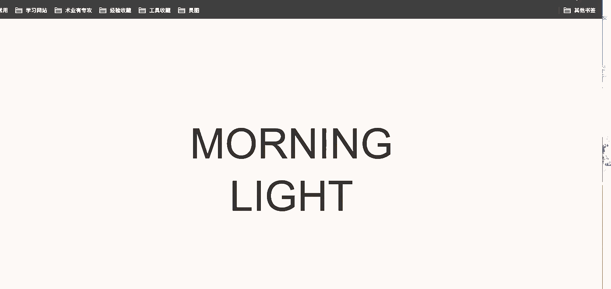

# 前端特效收集

[DEMO](https://keiferju.github.io/css3-tx/)

### 特效
1. [文字标题](tx/dllcn)
2. [404页面](tx/404_01)

### Canvas背景
1. [AnimatedBackground](canvas/AnimatedBackground)

2. [3DBackground](canvas/3DBackground)

3. [PoppingBubbles](canvas/PoppingBubbles)

4. [webgl-canvas](canvas/webgl-canvas)

### loading动画

1. [css3-flower-loading](loading/css3-flower-loading)