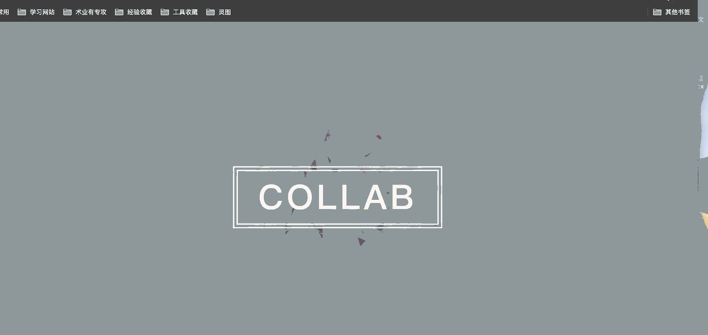
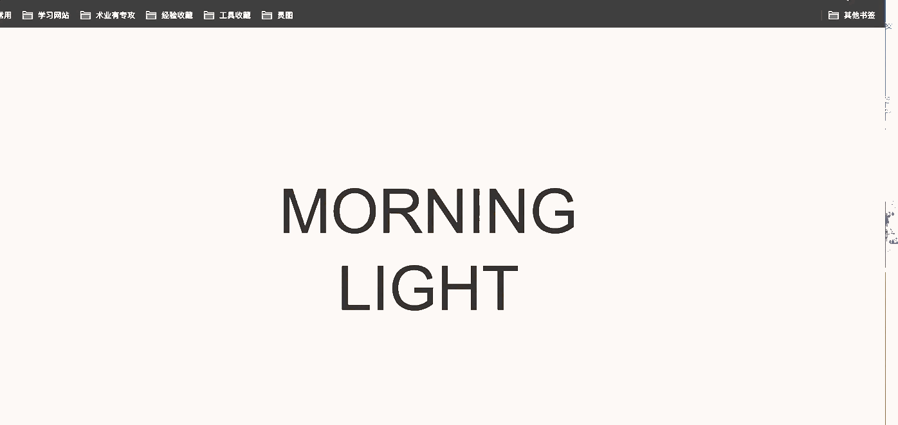
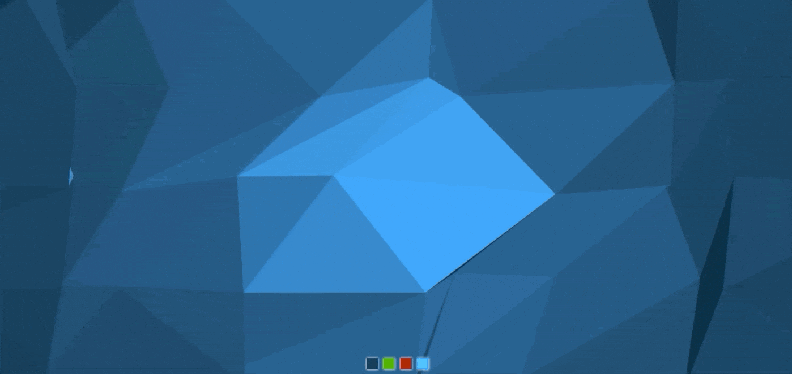

# 前端特效收集
来源于互联网的css特效整理

[更多DEMO](https://dllcnx.github.io/css3-anime/)

### 特效
1. [文字标题](anime/font/01)
2. [404页面](anime/404/01)

### Canvas背景
1. [AnimatedBackground](anime/canvas/AnimatedBackground)

2. [3DBackground](anime/canvas/3DBackground)

3. [PoppingBubbles](anime/canvas/PoppingBubbles)

4. [webgl-canvas](anime/canvas/webgl-canvas)

### loading动画

1. [01](anime/loading/00)
2. [01](anime/loading/01)
3. [01](anime/loading/02)
4. [01](anime/loading/03)
5. [01](anime/loading/04)
6. [01](anime/loading/05)
7. [01](anime/loading/06)
8. [01](anime/loading/07)

### 图片
1. [01](anime/images/checked)
2. [02](anime/images/adipoli)